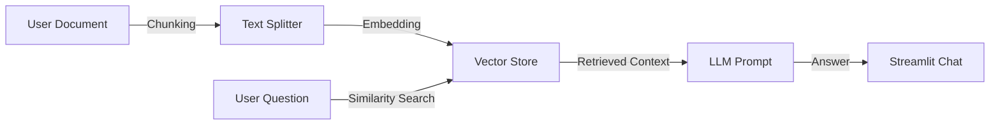
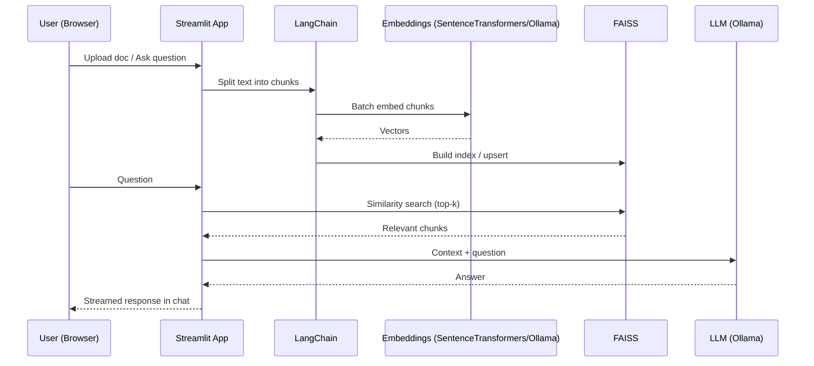

# 🤖 Context-Aware Product Assistant (RAG Pipeline)

    

## 📖 Project Overview
This application is a **Retrieval-Augmented Generation (RAG)** tool that lets you upload private docs (PRDs, notes, specs, PDFs) and query them with natural language. Answers are grounded in your content, not model training data.

### Why It Matters (Recruiter-Friendly)
- Reduces time-to-information for product teams by turning static docs into conversational knowledge.
- Demonstrates end-to-end ownership: ingestion, chunking, embeddings, vector DB, retrieval, and LLM orchestration.
- Built with practical trade-offs for MVP speed: local FAISS, CPU-friendly embeddings, clean UI, and deploy-ready config.

## ✨ Features
- Upload `txt`, `md`, `pdf`, `docx` and chat with the document.
- Fast, local embeddings via SentenceTransformers (CPU) with batching.
- Optional remote embeddings and LLM via an Ollama server.
- Persistent session: ask multiple questions after a single upload.
- FAISS vector store for low-latency retrieval on a single machine.

## ⚙️ Architecture & Logic
This project implements the standard "AI Stack" for modern generative applications:

1. **Ingestion:** Upload raw text/markdown/PDF/DOCX.
2. **Chunking:** Split into manageable chunks with overlap to preserve context.
3. **Embedding:** Convert chunks to dense vectors (local SentenceTransformers or remote Ollama embeddings).
4. **Vector Storage:** Store vectors in **FAISS** for fast similarity search.
5. **Retrieval:** Pull top-k relevant chunks based on cosine similarity.
6. **Generation:** Compose prompt with retrieved context; the LLM produces the final answer.





## 🧰 Tech Stack
- **UI:** Streamlit (chat UI, session state)
- **Orchestration:** LangChain (retrieval chain, splitters)
- **Embeddings:** SentenceTransformers (local CPU) or Ollama embeddings
- **LLM:** Ollama-hosted model (e.g., `qwen2.5:0.5b`)
- **Vector Store:** FAISS (in-memory, single-node)
- **Parsing:** `pypdf`, `python-docx`

## 🚀 Quickstart
```bash
# 1) Create & activate venv
python3 -m venv venv
source venv/bin/activate

# 2) Install dependencies
pip install -r requirements.txt

# 3) Run the app (localhost:8501)
streamlit run app.py --server.port 8501 --server.headless true
```

> Using Ollama? Ensure your server is reachable. The base URL is currently set in `app.py` and defaults to `http://your_server:11434`. Update it to match your environment.

## ⚡ Performance & Design Choices
- **Local embeddings default:** `sentence-transformers/all-MiniLM-L6-v2` for speed and quality on CPU.
- **Batching:** Embedding in batches (64) to minimize overhead.
- **Session persistence:** FAISS index and QA chain cached per session for multi-question chat.
- **Chunking:** Tuned chunk size and overlap to balance recall vs speed.
- **Optional remote path:** Swap to Ollama embeddings when network and server capacity are available.

## 🔧 Configuration
- **Streamlit:** `.streamlit/config.toml` disables CORS/XSRF for local dev.
- **Ports:** App runs on `8501` by default; override with `--server.port`.
- **Ollama URL:** Edit `ollama_base_url` in `app.py` to your host.

## 🔒 Privacy & Security
- No secrets are committed. `.gitignore` excludes `venv/`, `.streamlit/`, and `streamlit.log`.
- All processing happens locally; vectors remain on your machine.

## 📈 Roadmap
- Persistent on-disk cache of embeddings keyed by file hash.
- Multi-file workspace support and per-project indexes.
- Smaller/faster embedding model toggle (e.g., `bge-small-en-v1.5`).
- Docker packaging for one-command startup.
- Basic auth and role-based access.

## 📝 Notes for Recruiters
- Demonstrates practical RAG architecture with lean infra.
- Shows hands-on decisions to reduce latency and complexity (FAISS, local ST embeddings, batching).
- Clean UX with chat history and clear status/progress indicators.
- Built to be extended: swap models, add persistence, or deploy in containers.
